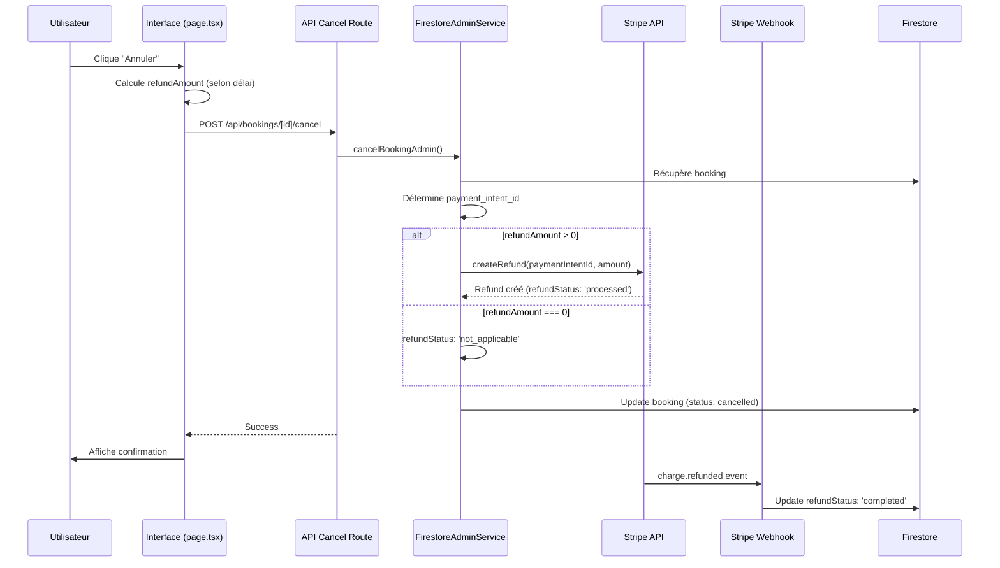
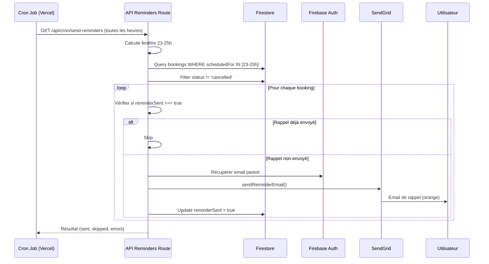

# Documentation - Remboursements et Rappels Automatiques

## 📋 Table des matières

1. [Remboursements Stripe](#remboursements-stripe)
2. [Rappels 24h Automatiques](#rappels-24h-automatiques)
3. [Configuration](#configuration)
4. [Tests](#tests)
5. [Dépannage](#dépannage)

---

## 💰 Remboursements Stripe

### Vue d'ensemble

Le système de remboursement automatique permet de traiter les remboursements Stripe directement lors de l'annulation d'une réservation, selon la politique d'annulation définie.

### Politique d'annulation

| Délai avant la réservation | Remboursement |
|----------------------------|---------------|
| Plus de 48 heures | Remboursement complet de l'acompte (30%) |
| Entre 24h et 48h | Aucun remboursement (acompte perdu) |
| Moins de 24h | Aucun remboursement |

### Architecture

#### Fichiers impliqués

1. **`src/lib/firestore-admin-service.ts`**
   - `cancelBookingAdmin()` : Fonction principale d'annulation avec remboursement
   - Utilise Firebase Admin SDK pour bypasser les règles de sécurité
   - Appelle l'API Stripe pour traiter le remboursement

2. **`src/lib/stripe-server.ts`**
   - `createRefund()` : Fonction qui crée un remboursement Stripe
   - Gère la conversion euros → centimes
   - Gère les erreurs Stripe

3. **`src/app/api/bookings/[id]/cancel/route.ts`**
   - API route pour annuler une réservation
   - Authentifie l'utilisateur
   - Calcule le montant du remboursement
   - Appelle `cancelBookingAdmin()`

4. **`src/app/api/webhooks/stripe/route.ts`**
   - Webhook handler pour l'événement `charge.refunded`
   - Met à jour le statut du remboursement dans Firestore
   - Confirme que le remboursement a été traité

5. **`src/app/dashboard/bookings/[id]/page.tsx`**
   - Interface utilisateur pour annuler une réservation
   - Calcule automatiquement le montant du remboursement
   - Appelle l'API `/api/bookings/[id]/cancel`

### Flux de remboursement



### Structure de données (Firestore)

Lors de l'annulation, le document booking est mis à jour :

```javascript
{
  status: 'cancelled',
  cancellation: {
    cancelledBy: 'parent' | 'accompanist' | 'admin',
    cancelledAt: Date,
    reason: string,
    refundAmount: number,
    refundStatus: 'pending' | 'processed' | 'completed' | 'not_applicable',
    stripeRefundId: string, // ID du remboursement Stripe
    refundedAt: Date, // Date de confirmation du remboursement par webhook
    refundError?: string // En cas d'erreur Stripe
  },
  updatedAt: Date
}
```

### États du remboursement

| État | Description |
|------|-------------|
| `pending` | Remboursement en attente (erreur Stripe) |
| `processed` | Remboursement envoyé à Stripe avec succès |
| `completed` | Remboursement confirmé par webhook Stripe |
| `not_applicable` | Aucun remboursement nécessaire (0€) |

### Gestion des erreurs

Si la création du remboursement Stripe échoue :

- Le booking est quand même annulé (status → 'cancelled')
- Le `refundStatus` reste à 'pending'
- Un champ `refundError` contient le message d'erreur
- L'administrateur peut traiter manuellement le remboursement dans Stripe Dashboard

**Raisons possibles d'échec** :

- PaymentIntent déjà remboursé
- Montant supérieur au montant payé
- Problème de connexion Stripe
- Clé API invalide

### Tests

#### Test 1 : Annulation avec remboursement (> 48h)

```bash
# 1. Créer une réservation de test
# 2. Payer l'acompte via Stripe
# 3. Attendre confirmation du paiement (webhook)
# 4. Aller sur la page de détail du booking
# 5. Cliquer "Annuler la réservation"
# 6. Vérifier dans Stripe Dashboard que le refund apparaît
```

#### Test 2 : Annulation sans remboursement (< 48h)

```bash
# 1. Créer une réservation de test pour demain
# 2. Payer l'acompte
# 3. Annuler la réservation
# 4. Vérifier que refundAmount = 0 et refundStatus = 'not_applicable'
```

#### Test webhook Stripe (local)

```bash
# Installer Stripe CLI
brew install stripe/stripe-cli/stripe

# Se connecter
stripe login

# Écouter les webhooks localement
stripe listen --forward-to http://localhost:9002/api/webhooks/stripe

# Dans un autre terminal, déclencher un événement test
stripe trigger charge.refunded
```

---

## 🔔 Rappels 24h Automatiques

### Vue d'ensemble

Le système de rappels automatiques envoie un email 24h avant chaque réservation pour rappeler à l'utilisateur la date et l'heure de son trajet.

### Architecture

#### Fichiers impliqués

1. **`src/app/api/cron/send-reminders/route.ts`**
   - API route appelée par le cron job Vercel
   - Recherche les bookings prévus dans 23-25h
   - Envoie un email de rappel via SendGrid
   - Marque le booking comme `reminderSent: true`

2. **`src/lib/email-service.ts`**
   - `sendReminderEmail()` : Fonction qui envoie l'email
   - Template HTML responsive orange (couleur d'alerte)
   - Affiche la date, l'heure, le trajet, le statut de paiement

3. **`vercel.json`**
   - Configuration du cron job Vercel
   - Schedules : toutes les heures (`0 */1 * * *`)

### Configuration du cron job

#### Vercel (recommandé pour production)

Dans `vercel.json` :

```json
{
  "crons": [
    {
      "path": "/api/cron/send-reminders",
      "schedule": "0 */1 * * *"
    }
  ]
}
```

**Syntaxe cron** :

- `0 */1 * * *` : Toutes les heures à la minute 0
- `0 9,12,15,18,21 * * *` : À 9h, 12h, 15h, 18h, 21h
- `0 * * * *` : Toutes les heures (plus fréquent)

**Limites Vercel** :

- Gratuit : 100 exécutions/jour
- Pro : 1000 exécutions/jour

#### Alternative : Node-Cron (auto-hébergé)

Si vous n'utilisez pas Vercel, vous pouvez créer un script Node.js avec `node-cron` :

```javascript
// scripts/cron-reminders.js
const cron = require('node-cron');
const fetch = require('node-fetch');

// Toutes les heures
cron.schedule('0 * * * *', async () => {
  console.log('Envoi des rappels...');
  
  const response = await fetch('https://votre-domaine.com/api/cron/send-reminders', {
    headers: {
      'Authorization': `Bearer ${process.env.CRON_SECRET}`
    }
  });
  
  const result = await response.json();
  console.log('Résultat:', result);
});
```

Lancer avec :

```bash
node scripts/cron-reminders.js
```

### Flux de rappel automatique



### Structure de données (Firestore)

Après l'envoi du rappel, le booking est mis à jour :

```javascript
{
  reminderSent: true,
  reminderSentAt: Date,
  // ... autres champs
}
```

### Sécurité : CRON_SECRET

Pour éviter que n'importe qui puisse appeler votre endpoint de cron, utilisez un secret :

#### Configuration

Dans `.env.local` et Vercel :

```env
CRON_SECRET=votre_secret_aleatoire_123456
```

Générer un secret sécurisé :

```bash
# Linux/Mac
openssl rand -base64 32

# Node.js
node -e "console.log(require('crypto').randomBytes(32).toString('base64'))"
```

#### Vérification dans la route

```typescript
const authHeader = request.headers.get('authorization');
const cronSecret = process.env.CRON_SECRET;

if (cronSecret && authHeader !== `Bearer ${cronSecret}`) {
    return NextResponse.json({ error: 'Non autorisé' }, { status: 401 });
}
```

#### Appel avec secret

```bash
curl -H "Authorization: Bearer votre_secret" \
     https://votre-domaine.com/api/cron/send-reminders
```

### Tests

#### Test manuel de l'endpoint

```bash
# Sans secret (si CRON_SECRET non configuré en développement)
curl http://localhost:9002/api/cron/send-reminders

# Avec secret
curl -H "Authorization: Bearer your_secret" \
     http://localhost:9002/api/cron/send-reminders
```

#### Test avec données factices

1. Créer une réservation de test prévue pour demain à la même heure
2. Appeler l'endpoint manuellement (ci-dessus)
3. Vérifier que l'email est envoyé
4. Vérifier que `reminderSent` est passé à `true`
5. Re-appeler l'endpoint → doit être "skipped"

#### Test de la fenêtre temporelle

La route cherche les bookings entre "maintenant + 23h" et "maintenant + 25h".

**Exemple** : Si maintenant = 15h00

- Début fenêtre : 14h00 (demain)
- Fin fenêtre : 16h00 (demain)
- Bookings trouvés : ceux prévus demain entre 14h et 16h

### Monitoring

#### Logs Vercel

Les logs de cron sont visibles dans le dashboard Vercel :

1. Aller sur Vercel Dashboard
2. Sélectionner votre projet
3. Onglet "Logs"
4. Filtrer par "Cron"

#### Résultat de l'API

L'API retourne un objet JSON détaillé :

```json
{
  "success": true,
  "message": "Rappels traités: 3 envoyés, 1 ignorés, 0 erreurs",
  "results": {
    "total": 4,
    "sent": 3,
    "skipped": 1,
    "errors": 0,
    "details": [
      {
        "bookingId": "abc123",
        "status": "sent",
        "parentEmail": "parent@example.com"
      },
      {
        "bookingId": "def456",
        "status": "skipped",
        "reason": "Rappel déjà envoyé"
      }
    ]
  }
}
```

---

## ⚙️ Configuration

### Variables d'environnement requises

```env
# SendGrid (pour les emails)
SENDGRID_API_KEY=SG.your_api_key
SENDGRID_FROM_EMAIL=contact@passerelle-jeunesse.fr

# Cron Job Security
CRON_SECRET=votre_secret_aleatoire

# Stripe (pour les remboursements)
STRIPE_SECRET_KEY=sk_test_your_key
STRIPE_WEBHOOK_SECRET=whsec_your_webhook_secret

# Firebase Admin (pour les opérations serveur)
FIREBASE_ADMIN_CREDENTIALS='{"type":"service_account",...}'
```

### Déploiement sur Vercel

1. **Push sur GitHub** :

   ```bash
   git add .
   git commit -m "feat: remboursements et rappels automatiques"
   git push
   ```

2. **Configurer les variables d'environnement** :
   - Aller sur Vercel Dashboard
   - Sélectionner votre projet
   - Settings → Environment Variables
   - Ajouter toutes les variables ci-dessus

3. **Redéployer** :
   - Le cron job sera automatiquement activé grâce à `vercel.json`
   - Vérifier dans Vercel Dashboard → Cron Jobs

---

## 🐛 Dépannage

### Remboursements

#### Problème : "Impossible de créer le remboursement"

**Causes possibles** :

1. PaymentIntent non trouvé → Vérifier que `payment.deposit.paymentIntentId` existe
2. Montant invalide → Le montant doit être ≤ au montant payé
3. PaymentIntent déjà remboursé → Vérifier dans Stripe Dashboard

**Solution** :

- Vérifier les logs dans la console Next.js
- Aller sur Stripe Dashboard → Logs
- Vérifier le booking dans Firestore
- Traiter manuellement le remboursement si nécessaire

#### Problème : refundStatus reste à 'pending'

**Cause** : Le webhook `charge.refunded` n'a pas été reçu

**Solution** :

1. Vérifier que le webhook est configuré dans Stripe Dashboard
2. Vérifier les logs webhook dans Stripe Dashboard → Developers → Webhooks
3. Re-envoyer le webhook manuellement si nécessaire
4. Vérifier `STRIPE_WEBHOOK_SECRET` dans `.env.local`

### Rappels automatiques

#### Problème : Les emails ne sont pas envoyés

**Causes possibles** :

1. Cron job non configuré → Vérifier `vercel.json`
2. SENDGRID_API_KEY invalide → Tester avec SendGrid API
3. Sender email non vérifié → Vérifier dans SendGrid Dashboard
4. Aucune réservation dans la fenêtre 23-25h

**Solution** :

- Appeler l'endpoint manuellement pour tester
- Vérifier les logs Vercel
- Vérifier les logs SendGrid (Activity Feed)

#### Problème : Rappels envoyés en double

**Cause** : Le champ `reminderSent` n'est pas correctement mis à jour

**Solution** :

- Vérifier que la mise à jour Firestore réussit
- Ajouter un index Firestore sur `reminderSent` pour optimiser les requêtes
- Vérifier les logs de l'API

#### Problème : Cron job ne s'exécute pas

**Solution pour Vercel** :

1. Vérifier que vous êtes sur un plan qui supporte les crons
2. Vérifier que `vercel.json` est à la racine du projet
3. Redéployer le projet
4. Vérifier dans Vercel Dashboard → Cron Jobs

**Alternative** :

- Utiliser un service externe comme [cron-job.org](https://cron-job.org)
- Configurer pour appeler votre endpoint toutes les heures

---

## 📊 Métriques et KPIs

### Remboursements

- Nombre de remboursements par mois
- Montant total remboursé
- Délai moyen entre annulation et remboursement confirmé
- Taux d'erreur des remboursements

### Rappels

- Nombre de rappels envoyés par jour
- Taux de délivrabilité (via SendGrid analytics)
- Taux d'ouverture des emails
- Taux de clics sur "Payer le solde"

---

## 🔄 Améliorations futures

### Remboursements

- [ ] Email de confirmation de remboursement
- [ ] Remboursement partiel manuel (admin dashboard)
- [ ] Historique des remboursements par utilisateur
- [ ] Statistiques de remboursements (dashboard admin)

### Rappels

- [ ] Rappels multiples (7 jours, 3 jours, 24h, 2h)
- [ ] SMS en plus des emails (Twilio)
- [ ] Personnalisation du délai de rappel par utilisateur
- [ ] Désactivation optionnelle des rappels (préférences utilisateur)
- [ ] Rappel pour l'accompagnateur assigné

---

## 📚 Ressources

### Documentation externe

- [Stripe Refunds API](https://stripe.com/docs/api/refunds)
- [Vercel Cron Jobs](https://vercel.com/docs/cron-jobs)
- [SendGrid API](https://docs.sendgrid.com/api-reference)
- [Firebase Admin SDK](https://firebase.google.com/docs/admin/setup)

### Fichiers du projet

- `docs/sendgrid-setup.md` - Configuration SendGrid
- `docs/stripe-setup.md` - Configuration Stripe (à créer)
- `docs/roadmap.md` - Roadmap du projet

---

**Dernière mise à jour** : 15/02/2026  
**Version** : 1.0
